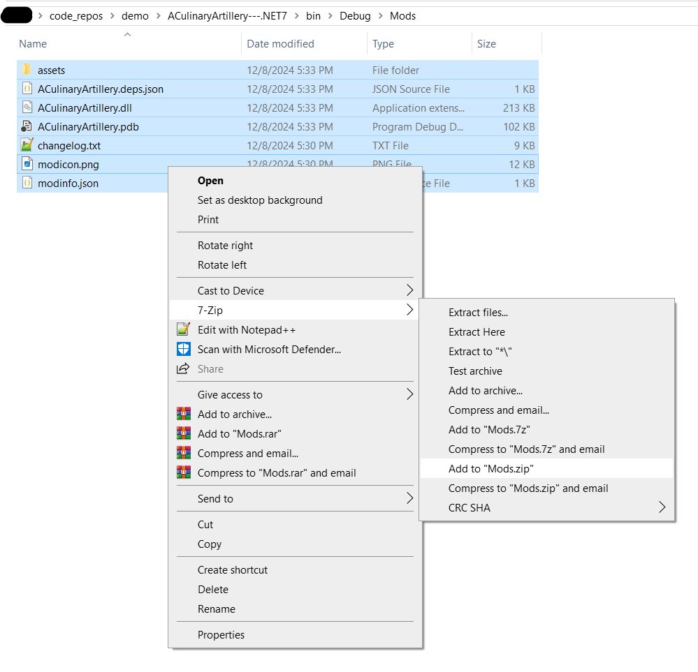
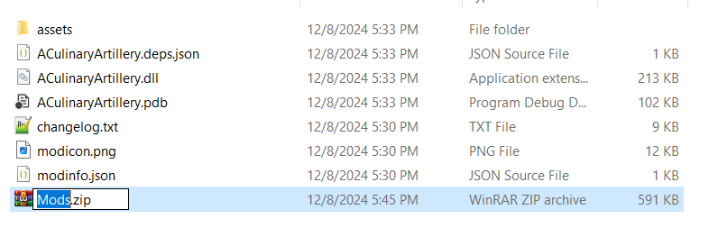
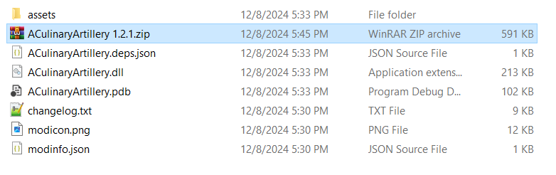
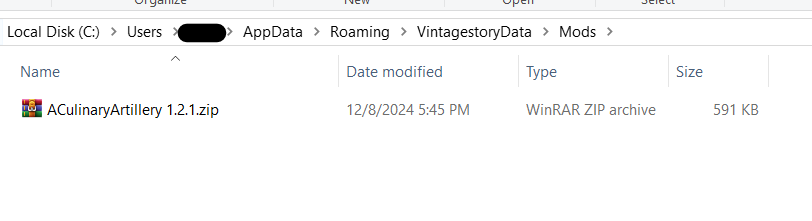

# BUILD
1) Clone the repo with Git, or download the files from github
2) Install dotnet sdk 7.0.x  https://dotnet.microsoft.com/en-us/download/dotnet/7.0
3) Set VINTAGE_STORY environment variable as detailed in modding documentation: https://wiki.vintagestory.at/index.php/Modding:Setting_up_your_Development_Environment#Setup_the_Environment
3a) After being set, you need to close and reopen powershell/terminal for the environment variable to be loaded into your terminal again
4) Run 
```bash
dotnet build .\ACulinaryArtillery.csproj
```
5) Navigate to .\bin\Debug\Mods
6) Zip all the files in that folder
7) Rename Mods.zip to "ACulinaryArtillery 1.2.1.zip"
8) Add zip to your mods folders.  If playing multiplayer, users need to manually install this version of the modding
8a) To help enforce the manuall install, you can update modinfo.json to a version not yet released, which will cause a popup ingame stating a manuall install is needed.

# Powershell / Commandline Example

1) Open Powershell and run commands below
```bash
PS C:\Users\JC_Array\> cd .\code_repos\demo\
PS C:\Users\JC_Array\code_repos\demo> git clone git@github.com:JC-Array/ACulinaryArtillery---.NET7.git
Cloning into 'ACulinaryArtillery---.NET7'...
remote: Enumerating objects: 2688, done.
remote: Counting objects: 100% (285/285), done.
remote: Compressing objects: 100% (108/108), done.
remote: Total 2688 (delta 203), reused 212 (delta 176), pack-reused 2403 (from 1)
Receiving objects: 100% (2688/2688), 1.32 MiB | 6.62 MiB/s, done.
Resolving deltas: 100% (1800/1800), done.
PS C:\Users\JC_Array\code_repos\demo> [Environment]::SetEnvironmentVariable("VINTAGE_STORY", "C:\Users\JC_Array\AppData\Roaming\Vintagestory", "User")
```
2) Close Powershell and reopen again

```bash
PS C:\Users\JC_Array> cd .\code_repos\demo\ACulinaryArtillery---.NET7\
PS C:\Users\JC_Array\code_repos\demo\ACulinaryArtillery---.NET7> echo $env:VINTAGE_STORY
C:\Users\JC_Array\AppData\Roaming\Vintagestory
PS C:\Users\JC_Array\code_repos\demo\ACulinaryArtillery---.NET7>
PS C:\Users\JC_Array\code_repos\demo\ACulinaryArtillery---.NET7> dotnet build .\ACulinaryArtillery.csproj
MSBuild version 17.7.6+77d58ec69 for .NET
  Determining projects to restore...
  Restored C:\Users\JC_Array\code_repos\demo\ACulinaryArtillery---.NET7\ACulinaryArtillery.csproj (in 224 ms).
C:\Program Files\dotnet\sdk\7.0.410\Microsoft.Common.CurrentVersion.targets(2364,5): warning MSB3277: Found conflicts between different versions of "System.Collections.Immutable" that could not be resolved. [C
:\Users\JC_Array\code_repos\demo\ACulinaryArtillery---.NET7\ACulinaryArtillery.csproj]
C:\Program Files\dotnet\sdk\7.0.410\Microsoft.Common.CurrentVersion.targets(2364,5): warning MSB3277: There was a conflict between "System.Collections.Immutable, Version=7.0.0.0, Culture=neutral, PublicKeyToke
n=b03f5f7f11d50a3a" and "System.Collections.Immutable, Version=8.0.0.0, Culture=neutral, PublicKeyToken=b03f5f7f11d50a3a". [C:\Users\JC_Array\code_repos\demo\ACulinaryArtillery---.NET7\ACulinaryArtillery.csproj]
C:\Program Files\dotnet\sdk\7.0.410\Microsoft.Common.CurrentVersion.targets(2364,5): warning MSB3277:     "System.Collections.Immutable, Version=7.0.0.0, Culture=neutral, PublicKeyToken=b03f5f7f11d50a3a" was c
hosen because it was primary and "System.Collections.Immutable, Version=8.0.0.0, Culture=neutral, PublicKeyToken=b03f5f7f11d50a3a" was not. [C:\Users\JC_Array\code_repos\demo\ACulinaryArtillery---.NET7\ACulinaryA
rtillery.csproj]
C:\Program Files\dotnet\sdk\7.0.410\Microsoft.Common.CurrentVersion.targets(2364,5): warning MSB3277:     References which depend on "System.Collections.Immutable, Version=7.0.0.0, Culture=neutral, PublicKeyTo
ken=b03f5f7f11d50a3a" [C:\Program Files\dotnet\packs\Microsoft.NETCore.App.Ref\7.0.20\ref\net7.0\System.Collections.Immutable.dll]. [C:\Users\JC_Array\code_repos\demo\ACulinaryArtillery---.NET7\ACulinaryArtillery
.csproj]
C:\Program Files\dotnet\sdk\7.0.410\Microsoft.Common.CurrentVersion.targets(2364,5): warning MSB3277:         C:\Program Files\dotnet\packs\Microsoft.NETCore.App.Ref\7.0.20\ref\net7.0\System.Collections.Immuta
ble.dll [C:\Users\JC_Array\code_repos\demo\ACulinaryArtillery---.NET7\ACulinaryArtillery.csproj]
C:\Program Files\dotnet\sdk\7.0.410\Microsoft.Common.CurrentVersion.targets(2364,5): warning MSB3277:           Project file item includes which caused reference "C:\Program Files\dotnet\packs\Microsoft.NETCor
e.App.Ref\7.0.20\ref\net7.0\System.Collections.Immutable.dll". [C:\Users\JC_Array\code_repos\demo\ACulinaryArtillery---.NET7\ACulinaryArtillery.csproj]
C:\Program Files\dotnet\sdk\7.0.410\Microsoft.Common.CurrentVersion.targets(2364,5): warning MSB3277:             C:\Program Files\dotnet\packs\Microsoft.NETCore.App.Ref\7.0.20\ref/net7.0/System.Collections.Im
mutable.dll [C:\Users\JC_Array\code_repos\demo\ACulinaryArtillery---.NET7\ACulinaryArtillery.csproj]
C:\Program Files\dotnet\sdk\7.0.410\Microsoft.Common.CurrentVersion.targets(2364,5): warning MSB3277:     References which depend on "System.Collections.Immutable, Version=8.0.0.0, Culture=neutral, PublicKeyTo
ken=b03f5f7f11d50a3a" []. [C:\Users\JC_Array\code_repos\demo\ACulinaryArtillery---.NET7\ACulinaryArtillery.csproj]
C:\Program Files\dotnet\sdk\7.0.410\Microsoft.Common.CurrentVersion.targets(2364,5): warning MSB3277:         C:\Users\JC_Array\AppData\Roaming\Vintagestory\VintagestoryLib.dll [C:\Users\JC_Array\code_repos\demo\ACu
linaryArtillery---.NET7\ACulinaryArtillery.csproj]
C:\Program Files\dotnet\sdk\7.0.410\Microsoft.Common.CurrentVersion.targets(2364,5): warning MSB3277:           Project file item includes which caused reference "C:\Users\JC_Array\AppData\Roaming\Vintagestory\Vi
ntagestoryLib.dll". [C:\Users\JC_Array\code_repos\demo\ACulinaryArtillery---.NET7\ACulinaryArtillery.csproj]
C:\Program Files\dotnet\sdk\7.0.410\Microsoft.Common.CurrentVersion.targets(2364,5): warning MSB3277:             VintagestoryLib [C:\Users\JC_Array\code_repos\demo\ACulinaryArtillery---.NET7\ACulinaryArtillery.c
sproj]
C:\Users\JC_Array\code_repos\demo\ACulinaryArtillery---.NET7\ACulinaryArtillery.cs(112,13): warning CS0618: 'ICoreServerAPI.RegisterCommand(string, string, string, ServerChatCommandDelegate, string)' is obsolete:
 'Use ChatCommand subapi instead' [C:\Users\JC_Array\code_repos\demo\ACulinaryArtillery---.NET7\ACulinaryArtillery.csproj]
C:\Users\JC_Array\code_repos\demo\ACulinaryArtillery---.NET7\Item\ItemEggCrack.cs(141,17): warning CS0618: 'EntityControls.UsingHeldItemTransformBefore' is obsolete: 'Setting this value has no effect anymore. Add
 an animation to the seraph instead' [C:\Users\JC_Array\code_repos\demo\ACulinaryArtillery---.NET7\ACulinaryArtillery.csproj]
C:\Users\JC_Array\code_repos\demo\ACulinaryArtillery---.NET7\Item\ItemExpandedRawFood.cs(422,17): warning CS0612: 'CollectibleObject.IsBackPack(IItemStack)' is obsolete [C:\Users\JC_Array\code_repos\demo\ACulinaryAr
tillery---.NET7\ACulinaryArtillery.csproj]
C:\Users\JC_Array\code_repos\demo\ACulinaryArtillery---.NET7\Item\ItemExpandedRawFood.cs(424,64): warning CS0612: 'CollectibleObject.QuantityBackPackSlots(IItemStack)' is obsolete [C:\Users\JC_Array\code_repos\demo\
ACulinaryArtillery---.NET7\ACulinaryArtillery.csproj]
  ACulinaryArtillery -> C:\Users\JC_Array\code_repos\demo\ACulinaryArtillery---.NET7\bin\Debug\Mods\ACulinaryArtillery.dll

Build succeeded.

C:\Program Files\dotnet\sdk\7.0.410\Microsoft.Common.CurrentVersion.targets(2364,5): warning MSB3277: Found conflicts between different versions of "System.Collections.Immutable" that could not be resolved. [C
:\Users\JC_Array\code_repos\demo\ACulinaryArtillery---.NET7\ACulinaryArtillery.csproj]
C:\Program Files\dotnet\sdk\7.0.410\Microsoft.Common.CurrentVersion.targets(2364,5): warning MSB3277: There was a conflict between "System.Collections.Immutable, Version=7.0.0.0, Culture=neutral, PublicKeyToke
n=b03f5f7f11d50a3a" and "System.Collections.Immutable, Version=8.0.0.0, Culture=neutral, PublicKeyToken=b03f5f7f11d50a3a". [C:\Users\JC_Array\code_repos\demo\ACulinaryArtillery---.NET7\ACulinaryArtillery.csproj]
C:\Program Files\dotnet\sdk\7.0.410\Microsoft.Common.CurrentVersion.targets(2364,5): warning MSB3277:     "System.Collections.Immutable, Version=7.0.0.0, Culture=neutral, PublicKeyToken=b03f5f7f11d50a3a" was c
hosen because it was primary and "System.Collections.Immutable, Version=8.0.0.0, Culture=neutral, PublicKeyToken=b03f5f7f11d50a3a" was not. [C:\Users\JC_Array\code_repos\demo\ACulinaryArtillery---.NET7\ACulinaryA
rtillery.csproj]
C:\Program Files\dotnet\sdk\7.0.410\Microsoft.Common.CurrentVersion.targets(2364,5): warning MSB3277:     References which depend on "System.Collections.Immutable, Version=7.0.0.0, Culture=neutral, PublicKeyTo
ken=b03f5f7f11d50a3a" [C:\Program Files\dotnet\packs\Microsoft.NETCore.App.Ref\7.0.20\ref\net7.0\System.Collections.Immutable.dll]. [C:\Users\JC_Array\code_repos\demo\ACulinaryArtillery---.NET7\ACulinaryArtillery
.csproj]
C:\Program Files\dotnet\sdk\7.0.410\Microsoft.Common.CurrentVersion.targets(2364,5): warning MSB3277:         C:\Program Files\dotnet\packs\Microsoft.NETCore.App.Ref\7.0.20\ref\net7.0\System.Collections.Immuta
ble.dll [C:\Users\JC_Array\code_repos\demo\ACulinaryArtillery---.NET7\ACulinaryArtillery.csproj]
C:\Program Files\dotnet\sdk\7.0.410\Microsoft.Common.CurrentVersion.targets(2364,5): warning MSB3277:           Project file item includes which caused reference "C:\Program Files\dotnet\packs\Microsoft.NETCor
e.App.Ref\7.0.20\ref\net7.0\System.Collections.Immutable.dll". [C:\Users\JC_Array\code_repos\demo\ACulinaryArtillery---.NET7\ACulinaryArtillery.csproj]
C:\Program Files\dotnet\sdk\7.0.410\Microsoft.Common.CurrentVersion.targets(2364,5): warning MSB3277:             C:\Program Files\dotnet\packs\Microsoft.NETCore.App.Ref\7.0.20\ref/net7.0/System.Collections.Im
mutable.dll [C:\Users\JC_Array\code_repos\demo\ACulinaryArtillery---.NET7\ACulinaryArtillery.csproj]
C:\Program Files\dotnet\sdk\7.0.410\Microsoft.Common.CurrentVersion.targets(2364,5): warning MSB3277:     References which depend on "System.Collections.Immutable, Version=8.0.0.0, Culture=neutral, PublicKeyTo
ken=b03f5f7f11d50a3a" []. [C:\Users\JC_Array\code_repos\demo\ACulinaryArtillery---.NET7\ACulinaryArtillery.csproj]
C:\Program Files\dotnet\sdk\7.0.410\Microsoft.Common.CurrentVersion.targets(2364,5): warning MSB3277:         C:\Users\JC_Array\AppData\Roaming\Vintagestory\VintagestoryLib.dll [C:\Users\JC_Array\code_repos\demo\ACu
linaryArtillery---.NET7\ACulinaryArtillery.csproj]
C:\Program Files\dotnet\sdk\7.0.410\Microsoft.Common.CurrentVersion.targets(2364,5): warning MSB3277:           Project file item includes which caused reference "C:\Users\JC_Array\AppData\Roaming\Vintagestory\Vi
ntagestoryLib.dll". [C:\Users\JC_Array\code_repos\demo\ACulinaryArtillery---.NET7\ACulinaryArtillery.csproj]
C:\Program Files\dotnet\sdk\7.0.410\Microsoft.Common.CurrentVersion.targets(2364,5): warning MSB3277:             VintagestoryLib [C:\Users\JC_Array\code_repos\demo\ACulinaryArtillery---.NET7\ACulinaryArtillery.c
sproj]
C:\Users\JC_Array\code_repos\demo\ACulinaryArtillery---.NET7\ACulinaryArtillery.cs(112,13): warning CS0618: 'ICoreServerAPI.RegisterCommand(string, string, string, ServerChatCommandDelegate, string)' is obsolete:
 'Use ChatCommand subapi instead' [C:\Users\JC_Array\code_repos\demo\ACulinaryArtillery---.NET7\ACulinaryArtillery.csproj]
C:\Users\JC_Array\code_repos\demo\ACulinaryArtillery---.NET7\Item\ItemEggCrack.cs(141,17): warning CS0618: 'EntityControls.UsingHeldItemTransformBefore' is obsolete: 'Setting this value has no effect anymore. Add
 an animation to the seraph instead' [C:\Users\JC_Array\code_repos\demo\ACulinaryArtillery---.NET7\ACulinaryArtillery.csproj]
C:\Users\JC_Array\code_repos\demo\ACulinaryArtillery---.NET7\Item\ItemExpandedRawFood.cs(422,17): warning CS0612: 'CollectibleObject.IsBackPack(IItemStack)' is obsolete [C:\Users\JC_Array\code_repos\demo\ACulinaryAr
tillery---.NET7\ACulinaryArtillery.csproj]
C:\Users\JC_Array\code_repos\demo\ACulinaryArtillery---.NET7\Item\ItemExpandedRawFood.cs(424,64): warning CS0612: 'CollectibleObject.QuantityBackPackSlots(IItemStack)' is obsolete [C:\Users\JC_Array\code_repos\demo\
ACulinaryArtillery---.NET7\ACulinaryArtillery.csproj]
    5 Warning(s)
    0 Error(s)

Time Elapsed 00:00:05.09
PS C:\Users\JC_Array\code_repos\demo\ACulinaryArtillery---.NET7>
```

3) Open File Explorer
4) Zip Files



5) Rename Mods.zip to ACulinaryArtillery 1.2.1.zip




6) Place mod in your mods folder




